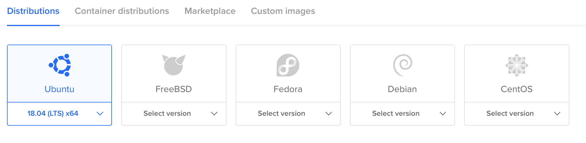
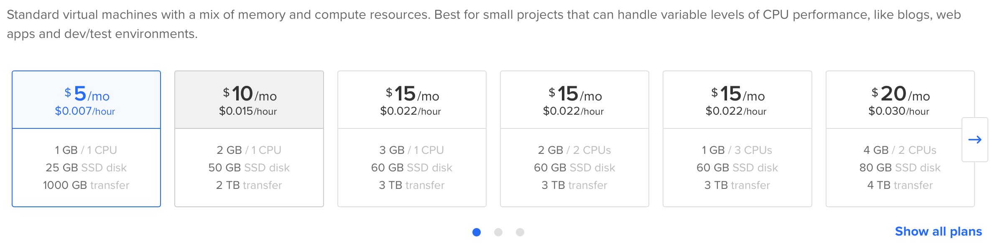
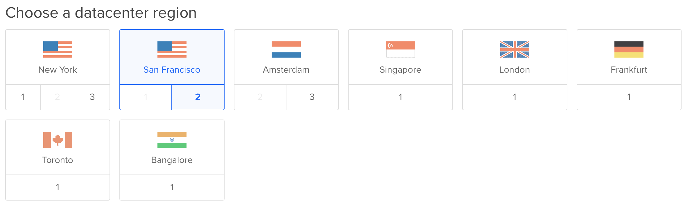

# SuStudio
## Introduction

This project was created for informational purposes.

    <figure>
        <figcaption>
            
        </figcaption>
    </figure>

## How to Run
### 1. Create Droplets:
You need to sign in on [DigitalOcean](https://cloud.digitalocean.com).
#### 1.1 Choose an Ubuntu 18.04(LTS)

    <figure>
        <figcaption>
            
        </figcaption>
    </figure>

#### 1.2 Choose a plan 5$ on month

    <figure>
        <figcaption>
            
        </figcaption>
    </figure>

#### 1.3 Choose a datacenter region, for me it is San Francisco.

    <figure>
        <figcaption>
            
        </figcaption>
    </figure>

### 2. DEVELOPING DJANGO APPLICATIONS: ON POSTGRESQL + NGINX + GUNICORN IN UBUNTU 18.04
#### 2.1 Initial server setup guide [ENG](https://www.digitalocean.com/community/tutorials/initial-server-setup-with-ubuntu-18-04) [RUS](https://www.8host.com/blog/nachalnaya-nastrojka-servera-ubuntu-18-04/)
#### 2.2 Developing Django Applications Instruction [ENG](https://www.digitalocean.com/community/tutorials/how-to-set-up-django-with-postgres-nginx-and-gunicorn-on-ubuntu-18-04) [RUS](https://www.8host.com/blog/razrabotka-django-prilozheniya-na-postgresql-nginx-gunicorn-v-ubuntu-18-04/)
